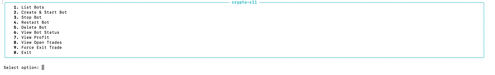
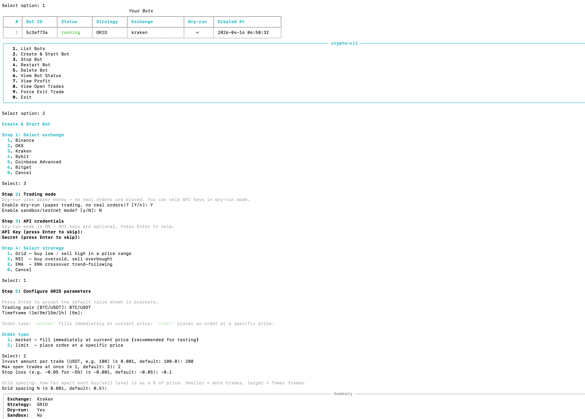
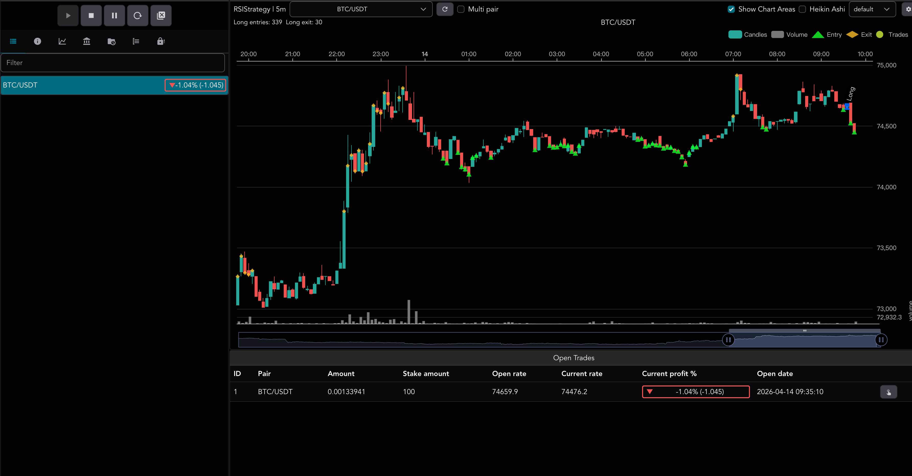

# SaintQuant Crypto Trading CLI

A standalone, open-source CLI tool for running crypto quantitative trading bots locally — no coding required.

It directly manages [Freqtrade](https://www.freqtrade.io/) processes on your machine, communicates with Freqtrade's built-in REST API, and stores all state in a local SQLite database. No web server, no external database, no intermediary service.

---

## Table of Contents

- [Prerequisites](#prerequisites)
- [Installation](#installation)
- [First Launch](#first-launch)
- [Proxy Setup](#proxy-setup)
- [Creating a Bot](#creating-a-bot)
- [Strategies and Parameters](#strategies-and-parameters)
- [Managing Bots](#managing-bots)
- [Security](#security)
- [Reset](#reset)

---

## Prerequisites

### 1. Python 3.10 or later

```bash
python3 --version   # must be >= 3.10
```

Download: [python.org/downloads](https://www.python.org/downloads/)

### 2. Freqtrade

```bash
pip install freqtrade
```

Verify the installation:

```bash
freqtrade --version
```

> If the `freqtrade` command is not found, `~/.local/bin` may not be on your PATH.
> Run `export PATH="$HOME/.local/bin:$PATH"` and try again, or add it to `~/.bashrc` / `~/.zshrc`.

---

## Installation

### From PyPI (once published)

```bash
pip install saintquant-crypto-trading-cli
```

### Local development install (current)

```bash
git clone <repo-url>
cd saintquant-crypto-trading-cli
pip install -e .
```

Verify:

```bash
saintbot-cli --version
```

---

## First Launch

```bash
saintbot-cli
```

On the first run, a setup wizard will guide you through:

1. **Freqtrade binary path** — auto-detected; press Enter to confirm
2. **Proxy** — enter a proxy URL if your exchange is geo-restricted (optional, can be changed later)

After setup, the main menu appears:

```
╔══════════════════════════════════╗
║    SaintQuant Trading CLI        ║
╠══════════════════════════════════╣
║  1. List Bots                    ║
║  2. Create & Start Bot           ║
║  3. Stop Bot                     ║
║  4. Restart Bot                  ║
║  5. Delete Bot                   ║
║  6. View Bot Status              ║
║  7. View Profit                  ║
║  8. View Open Trades             ║
║  9. Force Exit Trade             ║
║  0. Exit                         ║
╚══════════════════════════════════╝
```

> **[Screenshot: Main menu]**


---

## Proxy Setup

If your exchange (e.g. Binance, OKX) is not directly accessible from your network, configure a proxy:

```bash
# View current proxy
saintbot-cli proxy

saintbot-cli proxy http://127.0.0.1:1087

# Set a SOCKS5 proxy
saintbot-cli proxy socks5://127.0.0.1:1080

# Remove proxy (direct connection)
saintbot-cli proxy clear
```

The proxy is saved to `~/.crypto-cli/config.json` and applied automatically on every launch.

> **Note:** The proxy only applies to exchange API traffic. Local Freqtrade API calls (`127.0.0.1`) always bypass the proxy.

---

## Creating a Bot

From the main menu, select **2. Create & Start Bot** and follow the wizard:

### Step 1 — Select exchange

| Exchange | Passphrase required |
|----------|-------------------|
| Binance | No |
| OKX | **Yes** |
| Kraken | No |
| Bybit | No |
| Coinbase Advanced | No |
| Bitget | No |

### Step 2 — Trading mode

- **Dry-run (paper trading):** Uses virtual funds, no real orders placed. Recommended for testing.
- **Sandbox:** Connects to the exchange's official testnet. Requires a testnet API key.
- Both off = **live trading**.

### Step 3 — API credentials

Create an API key on your exchange and enter the Key and Secret (input is masked). In dry-run mode you can press Enter to skip.

### Step 4 — Select strategy

- **Grid** — Buy near the low of a price range, sell near the high. Best for sideways markets.
- **RSI** — Buy when oversold, sell when overbought. Best for mean-reverting markets.
- **EMA** — Buy on golden cross, sell on death cross. Best for trending markets.

### Step 5 — Configure parameters

All parameters have sensible defaults — press Enter on each field to accept them and start a bot quickly.

> **[Screenshot: Bot creation — parameter input]**


### Step 6 — Confirm and start

After confirming, the bot starts and you receive:

```
✓ Bot a1b2c3d4 started on port 49284
  Web UI:   http://127.0.0.1:49284
  Username: freqtrade
  Password: xxxxxxxxxxxxxxxx
```

Open the Web UI in your browser to view the candlestick chart, entry/exit signals, and open positions.

---

## Strategies and Parameters

### Common parameters (all strategies)

| Parameter | Default | Description |
|-----------|---------|-------------|
| `pair` | `BTC/USDT` | Trading pair in `BASE/QUOTE` format |
| `timeframe` | `5m` | Candle interval: `1m` `5m` `15m` `1h` `4h` |
| `order_type` | `market` | `market` = fill immediately at market price; `limit` = place a limit order |
| `invest_amount` | `100.0` | Amount to invest per trade (USDT) |
| `max_open_trades` | `3` | Maximum concurrent open positions (`-1` = unlimited) |
| `stop_loss` | `-0.05` | Stop-loss ratio, e.g. `-0.05` = exit at -5% |
| `take_profit` | — | Quick take-profit, e.g. `0.03` = exit at +3% |
| `trailing_stop` | `false` | Enable trailing stop-loss |

### Grid strategy — exclusive parameters

Buys near the bottom of a rolling 20-candle price range and sells near the top. Best for sideways, oscillating markets.

| Parameter | Default | Description |
|-----------|---------|-------------|
| `grid_spacing` | `0.5` | Grid interval as a percentage. Smaller = more signals, larger = fewer signals |

**Entry signal:** `close <= 20-candle low × (1 + grid_spacing%)`  
**Exit signal:** `close >= 20-candle high × (1 - grid_spacing%)`

**Recommended test settings:** `grid_spacing=0.3`, `timeframe=1m` for more frequent signals.

### RSI strategy — exclusive parameters

Buys when RSI drops below the oversold threshold, sells when it rises above the overbought threshold.

| Parameter | Default | Description |
|-----------|---------|-------------|
| `rsi_buy` | `35` | Buy when RSI(14) drops below this value. Higher = more signals |
| `rsi_sell` | `65` | Sell when RSI(14) rises above this value. Lower = more signals |

**Entry signal:** `RSI(14) < rsi_buy`  
**Exit signal:** `RSI(14) > rsi_sell`

**Recommended test settings:** `rsi_buy=40`, `rsi_sell=60`, `timeframe=1m`

### EMA strategy — exclusive parameters

Buys on a golden cross (short EMA crosses above long EMA), sells on a death cross.

| Parameter | Default | Description |
|-----------|---------|-------------|
| `ema_short` | `9` | Short EMA period. Smaller = more sensitive |
| `ema_long` | `21` | Long EMA period. Must be greater than `ema_short` |

**Entry signal:** `ema_short` crosses above `ema_long` (golden cross)  
**Exit signal:** `ema_short` crosses below `ema_long` (death cross)

**Recommended test settings:** `ema_short=5`, `ema_long=10`, `timeframe=1m`

---

## Managing Bots

| Menu option | Description |
|-------------|-------------|
| **1. List Bots** | Show all bots with ID, status, strategy, exchange |
| **6. View Bot Status** | Show bot details and Freqtrade Web UI URL |
| **7. View Profit** | Show total profit %, realised profit %, trade count |
| **8. View Open Trades** | Show all open positions with entry price and current P&L |
| **9. Force Exit Trade** | Immediately close a specific trade at market price |
| **3. Stop Bot** | Stop the bot process (record is kept) |
| **4. Restart Bot** | Restart the bot without re-entering any configuration |
| **5. Delete Bot** | Stop and permanently delete the bot record |

> **[Screenshot: Freqtrade Web UI — candlestick chart with signals and open positions]**


---

## Security

- Exchange API keys and secrets are encrypted at rest using [Fernet](https://cryptography.io/en/latest/fernet/) symmetric encryption.
- The encryption key is derived from your machine ID — the database cannot be decrypted on a different machine.
- Temporary Freqtrade config files (which contain credentials) are deleted immediately after the subprocess reads them, regardless of whether startup succeeds or fails.
- Config and database files are created with `600` permissions (owner read/write only).
- Raw credentials are never written to logs at any log level.

---

## Reset

```bash
# Re-run the setup wizard (bot data is preserved)
saintbot-cli setup

# Full reset — deletes all config and bot data
saintbot-cli setup --reset
```

---

## License

MIT
